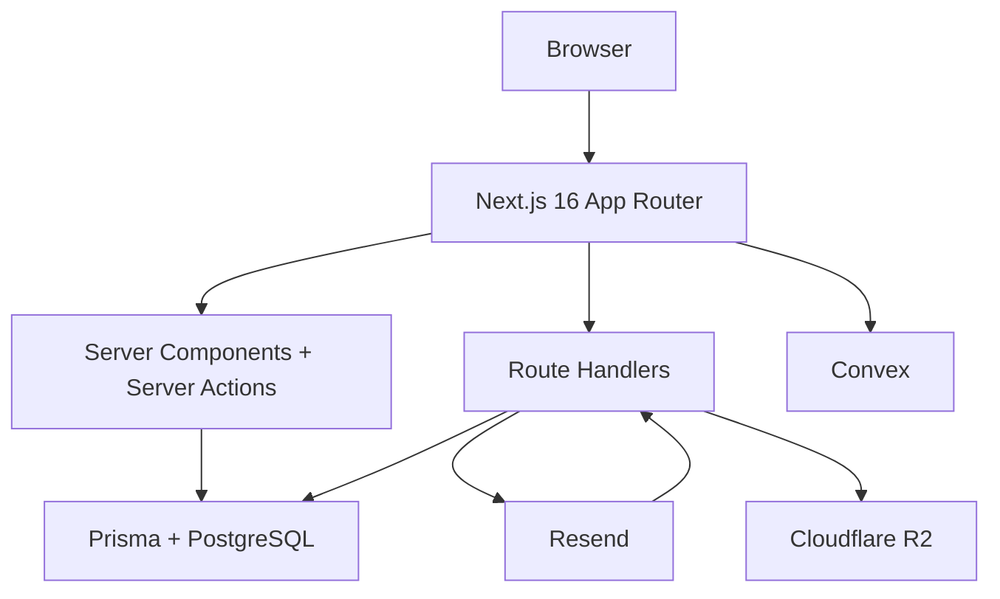

# MailPulse

MailPulse est une plateforme open source d'email marketing avec analytics temps reel, tracking, onboarding multi-organisation et dashboard operable par une equipe marketing.

## Ce que contient le projet

- Dashboard App Router pour gerer campagnes, contacts, automations, pages de capture et analytics
- Authentification Better Auth avec organisations, OAuth et passkeys
- Persistance metier via Prisma + PostgreSQL
- Temps reel dashboard via Convex
- Envoi d'emails et webhooks via Resend
- Upload d'assets via Cloudflare R2

## Stack reelle

| Couche | Technologie |
| --- | --- |
| Frontend | Next.js 16 App Router + React 19 + Tailwind CSS v4 |
| UI | composants metier internes + Lucide + Motion + TipTap |
| Donnees metier | Prisma 7 + PostgreSQL |
| Temps reel | Convex |
| Auth | Better Auth + organization plugin + passkeys |
| Email | Resend |
| Stockage | Cloudflare R2 |

## Architecture



### Repartition des responsabilites

- `Prisma + PostgreSQL` stocke les contacts, campagnes, analytics, organisations, expediteurs, domaines et tables d'auth.
- `Convex` porte les notifications live, la presence, l'activity feed et les stats reactives du dashboard.
- `Resend` gere l'envoi d'emails et renvoie les evenements de delivrabilite, ouverture, clic et plainte.
- `Cloudflare R2` sert aux uploads et assets publics.

## Organisation du code

- `src/app`: pages App Router, layouts, route handlers et pages dashboard
- `src/components`: UI metier par domaine, dont dashboard, landing, docs et editor
- `src/lib`: integrations, helpers serveur, auth, analytics, tracking et stockage
- `convex`: schema et fonctions temps reel
- `prisma`: schema relationnel et migrations

## Flux importants

### Flux contact

1. Un contact est cree depuis le dashboard, un CSV ou une capture page.
2. La donnee est enregistree dans Prisma.
3. Les tags, segments, campagnes et analytics reutilisent cette base.

### Flux campagne

1. Une campagne est configuree via le dashboard.
2. Le contenu et les destinataires sont persistes dans Prisma.
3. L'envoi est confie a Resend.
4. Les recipients et analytics de campagne sont mis a jour au fil des evenements.

### Flux tracking et analytics

1. Les clics et ouvertures arrivent via les routes de tracking et webhooks.
2. Les evenements alimentent Prisma.
3. Le dashboard live se met a jour via Convex.

## Installation locale

### Prerequis

- Node.js 24+
- pnpm
- PostgreSQL local ou instance Neon

### Installation

```bash
git clone https://github.com/James10192/mailpulse.git
cd mailpulse
pnpm install
cp .env.example .env.local
```

### Variables d'environnement principales

- `DATABASE_URL`
- `BETTER_AUTH_URL`
- `BETTER_AUTH_SECRET`
- `NEXT_PUBLIC_CONVEX_URL`
- `RESEND_API_KEY`
- `RESEND_WEBHOOK_SECRET`
- `TRACKING_SECRET`
- `NEXT_PUBLIC_APP_URL`
- `CLOUDFLARE_R2_ENDPOINT`
- `CLOUDFLARE_R2_ACCESS_KEY_ID`
- `CLOUDFLARE_R2_SECRET_ACCESS_KEY`
- `CLOUDFLARE_R2_BUCKET`
- `CLOUDFLARE_R2_PUBLIC_URL`

### Demarrage

```bash
docker compose up -d
npx prisma migrate dev
npx convex dev
pnpm dev
```

## Conventions utiles

- Les mutations UI vivent souvent dans des `actions.ts` proches des pages dashboard.
- Les integrations externes et helpers serveur vivent sous `src/lib`.
- Les routes externes sont sous `src/app/api`.
- Les pages serveur chargent la donnee; les interactions complexes sont deleguees a des composants client.

## Documentation integree

La doc embarquee est disponible sous `/docs` et couvre:

- installation
- architecture
- premiere campagne
- contacts, campagnes, automations et analytics
- routes API, auth et webhooks

## Etat du produit

- tracking email et webhooks en place
- dashboard multi-sections disponible
- onboarding, presence et notifications presentes
- responsive actuellement en cours de fiabilisation

## Contribution

1. Installe les dependances
2. Configure `.env.local`
3. Lance Prisma, Convex et l'app
4. Verifie `pnpm lint` puis `pnpm build` avant livraison

## License

MIT
